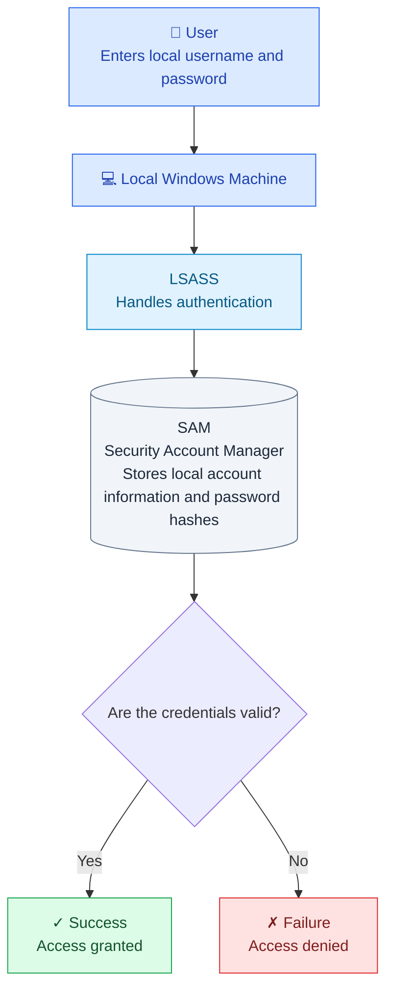
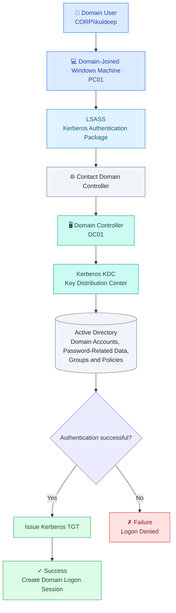
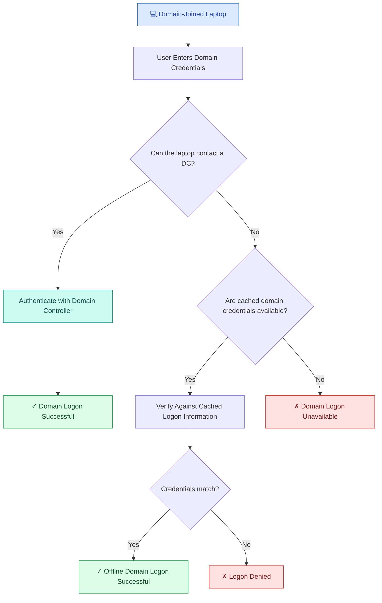
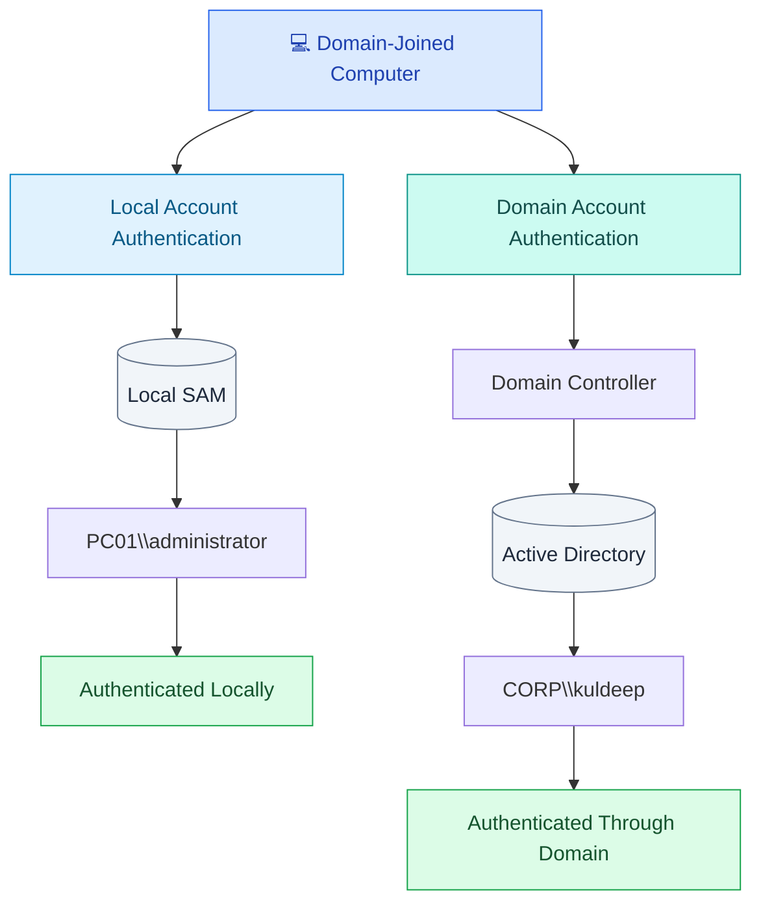
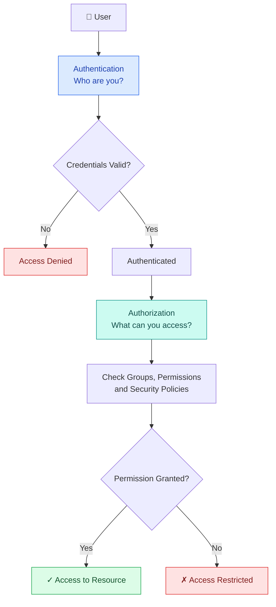
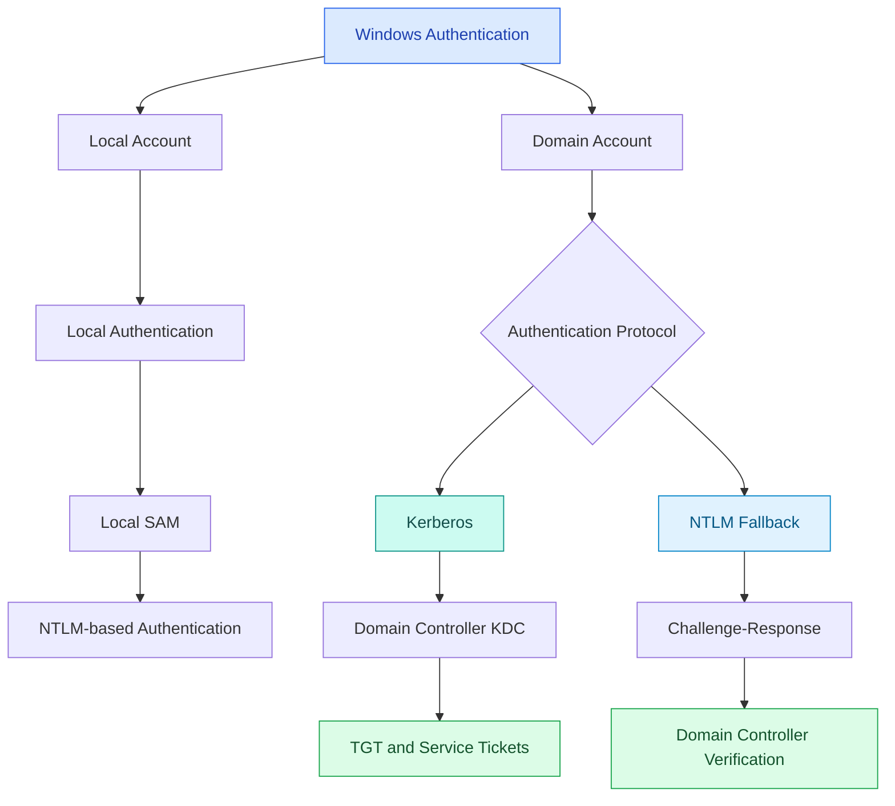

# Difference Between Authentication in a Normal Windows Machine and a Domain-Joined Windows Machine
The main difference between a normal (workgroup) Windows machine and a domain-joined Windows machine is where the user's credentials are verified and who controls authentication.

* Normal Windows machine: The computer itself verifies the user's credentials using its local account database (SAM).

* Domain-joined Windows machine: A Domain Controller (DC) typically verifies domain users' credentials using Active Directory (AD), commonly through Kerberos.

Let's understand this step by step, especially from an Active Directory and cybersecurity perspective.

# 1. Normal Windows machine (Workgroup)

A normal Windows machine that is not joined to a domain uses local authentication.

### How does it work?

Suppose your Windows laptop has a local account:

* Username: `kuldeep`

* Password: `YourPassword`

When you log in:

1. You enter your username and password.

2. Windows passes the authentication request to the Local Security Authority (LSA), with LSASS handling the authentication process.

3. Windows checks the local account information in the SAM database.

4. If the credentials are valid, Windows authenticates you and creates a logon session.

The SAM stores password hashes rather than plain-text passwords.

Important: The computer does not need to contact any Domain Controller or Active Directory server to authenticate a local account.

# 2. Domain-joined Windows machine

A domain-joined machine is connected to an organization's Active Directory (AD) domain. Instead of every computer independently managing all user accounts, a Domain Controller centrally manages domain accounts and verifies domain logins.

### How does it work?

Suppose a company has an Active Directory domain:

* Domain: `corp.local`

* Domain Controller: `DC01`

* Domain user: `kuldeep`

* Computer: `PC01`

When you log in using `CORP\kuldeep`:

1. You enter your domain username and password on `PC01`.

2. Windows uses LSASS to process the authentication request.

3. The computer communicates with a Domain Controller.

4. The DC's Kerberos Key Distribution Center validates the user's authentication using Active Directory information.

5. If authentication succeeds, the DC issues Kerberos tickets, beginning with a Ticket Granting Ticket (TGT).

6. Windows establishes a logon session, and the user can access resources according to their permissions.

The Domain Controller also provides centralized account management, password policies, group memberships and other domain-related controls.

Important: Kerberos is the default authentication protocol in a typical modern Active Directory domain, but Windows can also use NTLM in certain circumstances, such as when Kerberos cannot be used.

# 3. Key differences

| Feature                    | Normal Windows (Workgroup)      | Domain-joined Windows                           |
| -------------------------- | ------------------------------- | ----------------------------------------------- |
| Authentication             | Local authentication            | Usually domain authentication                   |
| Account database           | Local SAM                       | Active Directory on DC                          |
| Verification               | Local computer                  | Domain Controller, when available               |
| Common protocols           | NTLM-based local authentication | Kerberos, with NTLM fallback                    |
| Account management         | Individually on each computer   | Centrally managed through AD                    |
| Password policies          | Configured locally              | Can be centrally managed using Group Policy     |
| Centralized login          | No                              | Yes                                             |
| Offline login              | Yes                             | Yes, for local accounts                         |
| Cached domain login        | Not applicable                  | Possible, if previously configured and cached   |
| Single sign-on (SSO)       | Limited                         | Supported through Kerberos and other mechanisms |
| Centralized access control | Limited                         | Supported through domain groups and policies    |

# 4. What happens if the Domain Controller is offline?

This is an important concept in Active Directory.

Suppose you have a domain-joined laptop and you previously logged in successfully using your domain account.

Now imagine that you take your laptop home, where it cannot connect to the organization's Domain Controller.

You may still be able to log in using cached domain credentials.

Cached logon does not mean the laptop has become a local account. It is still a domain account, and the offline authentication is based on previously cached verification data.

# 5. Does a domain-joined machine still have a SAM database?

Yes! This is a common point of confusion.

Even after joining a Windows computer to a domain, the computer retains its local SAM database.

For example, a domain-joined computer may have:

* Local account: `PC01\administrator`

* Domain account: `CORP\kuldeep`

Both accounts can be used to log in, provided they are enabled and permitted to log on.

You can explicitly specify which account you want to use on the Windows login screen:

* `.\administrator` — the computer's local account.

* `CORP\kuldeep` — a domain account.

* `kuldeep@corp.local` — a domain account using its User Principal Name (UPN), assuming that is the account's UPN.

# 6. Authentication vs authorization

These two concepts are especially important when learning Active Directory exploitation.

* Authentication: Proves who you are.

* Authorization: Determines what you are allowed to access.

For example, a domain user might successfully authenticate to a computer but not have permission to install software or access a restricted folder.

Active Directory group memberships, local groups, file permissions, security policies and other access-control mechanisms can determine what that user is authorized to do.

# 7. How this relates to Kerberos and NTLM

Kerberos

* The default authentication protocol in modern Active Directory domains.

* Uses tickets, such as TGTs and service tickets.

* Supports mutual authentication and single sign-on.

* Uses a Key Distribution Center hosted on the Domain Controller.

NTLM

* A challenge-response authentication protocol.

* Can be used for local accounts and in certain domain authentication scenarios.

* Does not use Kerberos-style tickets.

* May be used when Kerberos is unavailable or incompatible with a particular authentication scenario.

From a cybersecurity perspective, Kerberos tickets, NTLM authentication, cached credentials and the distinction between local and domain accounts are all important concepts in Windows security and Active Directory assessments.

# 8. Simple Analogy

A normal Windows machine is like a building where each building manager maintains their own list of authorized people.

A domain-joined Windows machine is like a company where a central office manages employee identities and provides authentication services to multiple buildings.

Each building can still have its own local accounts and access rules, even though it belongs to the same company.

# Key takeaway:

• **Workgroup**: Each computer manages its own local accounts and authentication.

• **Domain**: Active Directory centrally manages domain accounts, and Domain Controllers provide authentication services.

• **Domain-joined computers**: Still retain local accounts and a SAM database, and can support offline domain logons through cached credentials.