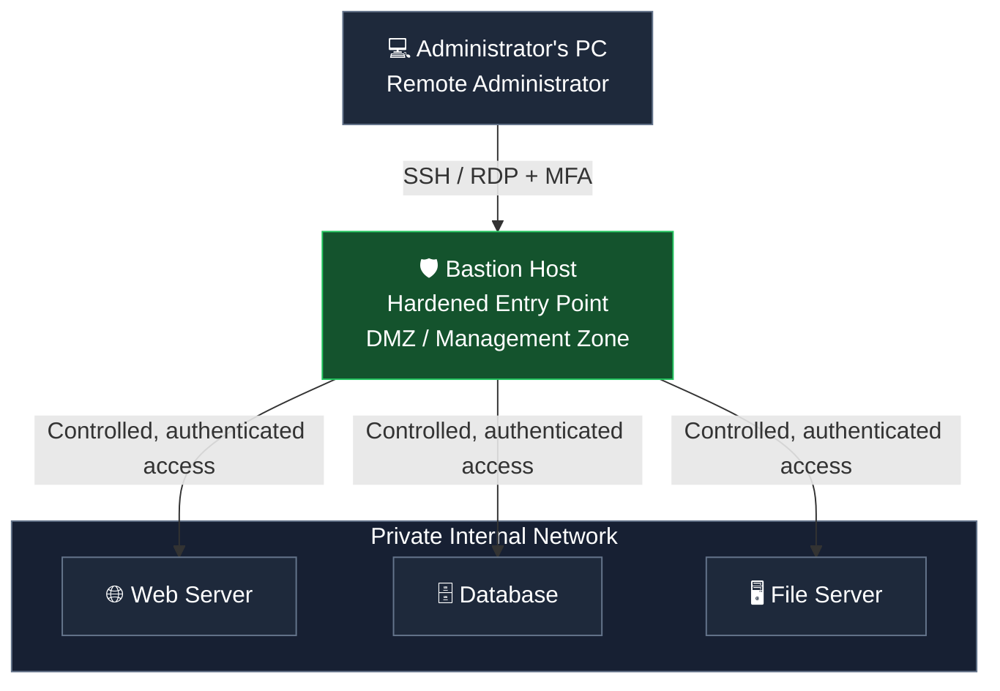

# Bastion Host 

A Bastion Host is a specially secured computer or server that acts as a controlled entry point into a private network. It allows administrators to securely access internal servers without exposing those servers directly to the internet.

Think of it as a security checkpoint or guarded gate between the internet and your internal network.

## 1. Where does a Bastion Host sit: DMZ or MZ?

A bastion host is commonly placed in a DMZ (Demilitarized Zone), but it can also be placed in a dedicated management zone (MZ), depending on the network architecture.

Conceptual network layout: the bastion host is placed in a controlled zone between external access and internal resources.

* DMZ: A separate network segment between the internet and the internal network, often used for systems that need controlled external access.

* MZ (Management Zone): A dedicated network segment for managing infrastructure, such as servers, network devices and security appliances.

* Bastion host: The hardened machine that administrators connect to before accessing protected internal systems.

The exact placement depends on the organization's design. For example, a bastion host exposed to administrator connections from the internet may be in a DMZ, while an internal-only bastion host may be in a management zone.

## 2. How does a Bastion Host work?

Imagine a company has three internal servers that should not be directly accessible from the internet.

### Network Architecture

### How it works

1. **Administrator's PC:** An administrator wants to access an internal server remotely.
2. **Connection to Bastion Host:** The administrator connects to the bastion host using SSH or RDP, with strong authentication such as MFA.
3. **Authentication:** The bastion host verifies the administrator's identity and access permissions.
4. **Internal Access:** Once authenticated, the administrator can connect to permitted internal servers through the bastion host.
5. **Monitoring:** The connections and administrative activities can be logged and monitored for auditing.

### Example

Suppose a company has:

* A Web Server
* A Database Server
* A File Server

All three servers are in a private internal network and are not directly accessible from the internet.

An administrator first connects to the Bastion Host and then accesses the required internal server through it.

**Key Point:** A Bastion Host acts as a secure, controlled entry point that reduces the need to expose internal servers directly to the internet.

## 3. Why do we use a Bastion Host?

| Purpose                | Explanation                                                                              |
| ---------------------- | ---------------------------------------------------------------------------------------- |
| Reduced attack surface | Internal servers don't need to expose management ports to the internet.                  |
| Centralized access     | Administrators can access multiple permitted servers through one controlled entry point. |
| Auditing               | Connections and administrative activity can be logged and monitored.                     |
| Access control         | Only authorized users can connect, with permissions restricted by role.                  |
| Network segmentation   | Helps isolate the internal network from direct external access.                          |

A bastion host itself is a high-value target. That's why it should be hardened, regularly patched, protected with MFA and monitored. It does not automatically make the internal network secure.

## 4. Is a Bastion Host only used in cloud networks?

No. Bastion hosts are used in both traditional on-premises networks and cloud networks.

On-premises networks

An organization has physical servers in its own data center. It deploys a bastion host in a DMZ or management network so administrators can securely access internal servers remotely.

Cloud networks (AWS, Azure, GCP)

An organization deploys a bastion host in a public subnet or dedicated access subnet to provide controlled SSH or RDP access to virtual machines in private subnets.

Hybrid networks

An organization connects its on-premises data center to a cloud environment. Bastion hosts or other controlled access systems can be used in either environment, depending on the design.

## 5. Bastion Host vs. Jump Server

These terms are often used interchangeably, although there can be a distinction.

| Bastion Host                                                            | Jump Server                                                     |
| ----------------------------------------------------------------------- | --------------------------------------------------------------- |
| A hardened system designed to withstand exposure to untrusted networks. | An intermediary server used to access another system.           |
| Often placed in a DMZ or dedicated access zone.                         | Can be placed in a DMZ, management network or internal network. |
| Focuses on secure, controlled access.                                   | Focuses on providing a connection path between networks.        |

A bastion host is often a type of jump server, but not every jump server is necessarily hardened to the same standard as a bastion host.

## 6. Bastion Host in cybersecurity labs

For example, imagine you are managing a lab with a Kali Linux machine, a bastion host and an internal Windows server.

* Kali Linux is your administrator workstation.

* The bastion host is the authorized gateway.

* The Windows server is on a private network and does not accept direct external management connections.

You connect to the bastion host first and then use the permitted management protocol to connect to the Windows server.

This is also why bastion hosts are relevant to network security, firewall configuration, segmentation and access auditing.

A bastion host is a hardened system that provides controlled access to a protected network. It is commonly located in a DMZ or management zone and is used in on-premises, cloud and hybrid environments. Its purpose is to reduce direct exposure of internal systems and centralize secure administrative access.

# Is Every Server in the DMZ network is a basion host ?

No. Not every server in a DMZ is a bastion host. A bastion host is a specific type of hardened server designed to provide controlled access to other systems. A DMZ can contain several different types of servers, each serving a different purpose.

## 1. Different servers in a DMZ

| 🌐 Web Server                                | 🛡️ Bastion Host                                               |
| -------------------------------------------- | -------------------------------------------------------------- |
| Hosts websites accessible from the internet. | Provides controlled administrative access to internal systems. |
| ✉️ Mail Gateway                              | 🔀 Reverse Proxy                                               |
| Filters and relays email traffic.            | Forwards incoming requests to backend servers.                 |

| Server        | Main purpose                                                                 |
| ------------- | ---------------------------------------------------------------------------- |
| Web server    | Serves websites and web applications to users.                               |
| Bastion host  | Provides a controlled gateway for administrative access to internal systems. |
| Mail gateway  | Filters and relays email between networks.                                   |
| Reverse proxy | Receives client requests and forwards them to appropriate backend servers.   |
| DNS server    | May provide publicly accessible authoritative DNS services.                  |
| VPN gateway   | Provides authenticated remote access to a private network.                   |

## 2. The main difference

Internet-facing web server

Its purpose is to serve content to external users. For example, when you visit `example.com`, your browser sends a request to the web server.

Bastion host

Its purpose is to let authorized administrators securely access internal systems, such as private web servers, databases or Windows machines.

Both may be hardened and located in the DMZ, but their roles are different.

## 3. An important concept

A DMZ is a network zone, not a type of server.

For example, an organization might have:

* A DMZ containing a public web server and a bastion host.

* An internal network containing database servers and application servers.

* A management zone containing monitoring and administration systems.

Also, not every internet-facing server has to be in a DMZ; the network architecture determines its placement.

Remember: A bastion host is defined by its security role as a controlled access point, not simply by being located in a DMZ.
